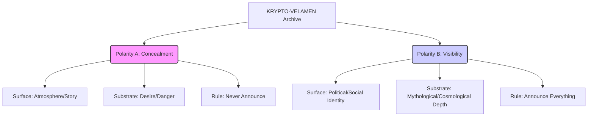

# KRYPTO-VELAMEN

<div align="center">
  <p align="center">
    <strong>κρυπτο- (krypto-) + velamen (Latin) — The hidden veil</strong>
  </p>
  <p align="center">
    <a href="https://github.com/organvm-ii-poiesis/krypto-velamen/actions/workflows/validate.yml"></a>
    
    
    
    
  </p>
</div>

---

A theory corpus and creative container for queer literary technique, archival practice, and the double-channel text. **KRYPTO-VELAMEN** is a living cultural instrument that documents lived interiority in real time, refusing narrative closure, technological fetishism, or moral framing.

## 📖 Table of Contents

- [Etymology and Ontological Name](#-etymology-and-ontological-name)
- [Core Model: Dual-Polarity Text](#-core-model-dual-polarity-text)
- [Author Dials & Craft Mechanisms](#-author-dials--craft-mechanisms)
- [Research Clusters](#-research-pipeline)
- [Tools & Infrastructure](#-unified-poiesis-workspace)
- [Document Manifest](#-document-manifest)
- [License](#-license)

---

## 🏛 Etymology and Ontological Name

The name fuses a Greek prefix with a Latin noun:

- **κρυπτο- (krypto-)** — hidden, concealed, secret. Not deception but structural concealment: something present but not immediately legible.
- **velamen** — veil, covering, membrane. The covering that both hides and reveals sacred content.

Together, they name the compositional engine of writing that operates on two channels at once: what a default reader consumes on the surface, and what a queer-attuned reader detects as the real emotional plot beneath.

---

## ⚙️ Core Model: Dual-Polarity Text

Every piece of writing in this archive operates on two frequencies simultaneously. As of Phase 5, the model supports two distinct polarities:



### Polarity A: Concealment Mode (Classic)
- **$SURFACE_STORY**: Publicly legible, complete on its own.
- **$SUBSTRATE_STORY**: Queer-attuned reader detects hidden desire.
- **Rule**: Make the reader infer queerness through the costs of concealment.

### Polarity B: Visibility Mode (Inversion)
- **Signal**: Produced by the *toll of exposure* (exhaustion, rage, isolation).
- **Substrate**: The mythological meaning that exceeds the audience's capacity to process the visible.
- **Rule**: The "Stage" is the site of the wound.

---

## 🎛 Author Dials & Craft Mechanisms

We map technique through foundational influences, treated as operational parameters:

### Author Dials
- **$RIMBAUD_DRIFT**: Desire as weather (lyric fracture, sensory overload).
- **$WILDE_MASK**: Truth as performance (wit, ornament, paradox).
- **$BURROUGHS_CONTROL**: Desire under surveillance (systems, paranoia, mechanism).
- **$LORDE_VOICE**: Intersectional depth (mythology, survival technology).
- **$ACKER_PIRACY**: Identity fragmentation (piracy, terminal privacy collapse).

### Six Core Craft Mechanisms
1. **Pronoun Drift**: Unstable reference; refusal to pin down the beloved.
2. **Negative Space**: Ellipsis, hard cuts; the absence is the loudest data.
3. **Overdetermined Details**: Mundane objects carrying disproportionate emotional weight.
4. **Public Mask vs Private Voice**: Friction between social persona and interiority.
5. **Camp as Encryption**: Style as cipher; defensive encoding.
6. **Surveillance as Third Entity**: The internalized watcher shaping the rhythm of the sentence.

---

## 📂 Research Pipeline

The project maintains a systematic research pipeline organized into five clusters:

- **Cluster A (Lyric Displacement)**: Rimbaud, Genet, Cavafy, Bishop.
- **Cluster B (Style as Alibi)**: Wilde, Forster, Auden.
- **Cluster C (Control Systems)**: Burroughs, Delany, Acker.
- **Cluster D (Modernity Bridges)**: Baldwin, Woolf, Williams.
- **Cluster E (Visibility Mode)**: Lorde, Arenas, Guibert.

Full reports are located in [`research/`](research/).

---

## 🛠 Unified Poiesis Workspace

We provide a suite of Python tools to assist in the production and validation of dual-channel texts.

### `tools/orchestrator.py`
The central command center for the repository.
```bash
# Display project status dashboard
python tools/orchestrator.py dashboard

# Scaffold a new fragment using a preset
python tools/orchestrator.py scaffold --slug "my-piece" --preset confessional-whisper

# Validate a fragment's integrity
python tools/orchestrator.py validate drafts/2026-02-17-my-piece.md

# Query the Mechanism Atlas
python tools/orchestrator.py lookup --mechanism "negative_space"
```

---

## 📑 Document Manifest

| Category | Path | Description |
|----------|------|-------------|
| **Core Theory** | [`docs/theory/`](docs/theory/) | Foundational documents including *Aesthetic of Hiding* and *Project Purpose*. |
| **Research** | [`research/`](research/) | Deep author reports and the complete 25-topic world research map. |
| **Synthesis** | [`research/synthesis/`](research/synthesis/) | Master Mechanism Atlas, Claims Ledger, and Calibration Matrix. |
| **Drafts** | [`drafts/`](drafts/) | Field I creative fragments and production templates. |
| **Source** | [`docs/source-material/`](docs/source-material/) | Shared research and ChatGPT export files. |

---

## 🤝 Contributing

This is a restricted-access creative corpus. If you wish to contribute to the research or technical infrastructure, please read [`CONTRIBUTING.md`](.github/CONTRIBUTING.md) and adhere to the [`CODE_OF_CONDUCT.md`](.github/CODE_OF_CONDUCT.md).

---

## ⚖️ License

All rights reserved. This is a creative-theoretical corpus; no license for reuse or training is granted without explicit permission. See [`LICENSE`](LICENSE) for details.

---

<div align="center">
  <sub>Generated by Organ II — POIESIS. Companion to <a href="https://github.com/organvm-ii-poiesis/chthon-oneiros">CHTHON-ONEIROS</a>.</sub>
</div>
